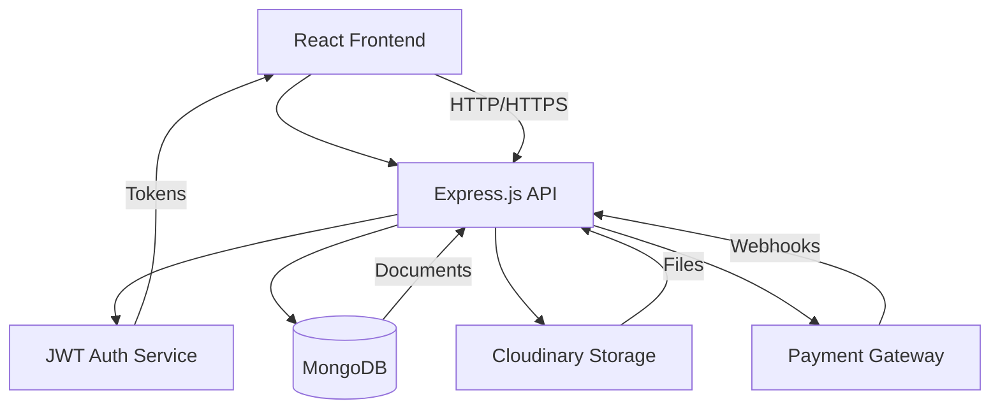

# 🔒 Technical Specifications

## Green Magic v2 E-commerce Platform

### 🏗️ System Architecture Overview



---

## 🎯 Core Requirements

### **Functional Requirements**

#### **User Management**

- Multi-role authentication (Customer, Vendor, Admin)
- JWT-based session management with refresh tokens
- Google OAuth integration
- Profile management with avatar uploads
- Address management for customers

#### **Vendor Management**

- Business registration with document verification
- Product catalog management
- Order fulfillment tracking
- Analytics and reporting
- Commission-based revenue model

#### **Product Management**

- Hierarchical category system
- Multiple product images
- Inventory tracking
- Product variants (size, color, etc.)
- SEO optimization fields

#### **E-commerce Operations**

- Shopping cart with persistence
- Checkout process with address selection
- Multiple payment methods (COD, Online)
- Order tracking and status updates
- Review and rating system

#### **Administrative Functions**

- Vendor verification and approval
- Product moderation
- Order management
- Platform analytics
- Content management

### **Non-Functional Requirements**

#### **Performance**

- API response time < 200ms for 95% of requests
- Frontend load time < 3 seconds
- Support for 1000+ concurrent users
- Database query optimization with proper indexing

#### **Security**

- HTTPS enforcement
- Input validation and sanitization
- SQL injection protection (MongoDB)
- XSS protection
- CSRF protection
- Rate limiting on API endpoints

#### **Scalability**

- Horizontal scaling capability
- Database sharding support
- CDN integration for static assets
- Caching strategy implementation

#### **Reliability**

- 99.9% uptime requirement
- Automated error monitoring
- Database backup strategy
- Graceful error handling

---

## 🗄️ Database Design

### **User Collection**

```javascript
{
  _id: ObjectId,
  username: String (unique, indexed),
  email: String (unique, indexed),
  fullname: String,
  avatar: String, // Cloudinary URL
  password: String, // bcrypt hashed
  googleId: String (unique, sparse),
  role: String, // 'customer', 'vendor', 'admin'
  isActive: Boolean,
  vendorProfile: ObjectId, // Reference to Vendor
  addresses: [{
    type: String, // 'home', 'office', 'other'
    fullName: String,
    phone: String,
    street: String,
    city: String,
    state: String,
    zipCode: String,
    country: String,
    isDefault: Boolean
  }],
  wishlist: [ObjectId], // Product references
  refreshToken: String,
  createdAt: Date,
  updatedAt: Date
}
```

### **Vendor Collection**

```javascript
{
  _id: ObjectId,
  userId: ObjectId, // Reference to User
  companyName: String,
  businessLicense: String, // Cloudinary URL
  gstNumber: String,
  businessAddress: {
    street: String,
    city: String,
    state: String,
    zipCode: String,
    country: String
  },
  contactInfo: {
    phone: String,
    alternateEmail: String,
    website: String
  },
  businessDescription: String,
  logo: String, // Cloudinary URL
  bankDetails: {
    accountHolderName: String,
    accountNumber: String,
    ifscCode: String,
    bankName: String
  },
  isVerified: Boolean,
  verificationStatus: String, // 'pending', 'approved', 'rejected', 'under_review'
  verificationNotes: String,
  rating: Number, // 0-5
  totalOrders: Number,
  totalRevenue: Number,
  commissionRate: Number, // Default 0.05 (5%)
  settings: {
    autoAcceptOrders: Boolean,
    minOrderAmount: Number,
    shippingCharges: Number
  },
  createdAt: Date,
  updatedAt: Date
}
```

### **Category Collection**

```javascript
{
  _id: ObjectId,
  name: String (unique),
  slug: String (unique, indexed),
  description: String,
  image: String, // Cloudinary URL
  icon: String,
  parentCategory: ObjectId, // Self-reference
  subcategories: [ObjectId], // Self-references
  isActive: Boolean,
  isFeatured: Boolean,
  sortOrder: Number,
  seoMeta: {
    title: String,
    description: String,
    keywords: [String]
  },
  createdBy: ObjectId, // User reference
  createdAt: Date,
  updatedAt: Date
}
```

### **Product Collection**

```javascript
{
  _id: ObjectId,
  name: String,
  slug: String (unique, indexed),
  description: String,
  shortDescription: String,
  category: ObjectId, // Category reference
  vendor: ObjectId, // Vendor reference
  images: [{
    url: String,
    alt: String,
    isMain: Boolean
  }],
  price: Number,
  discountPrice: Number,
  discountPercentage: Number,
  sku: String (unique),
  stock: Number,
  lowStockThreshold: Number,
  weight: String,
  dimensions: {
    length: Number,
    width: Number,
    height: Number,
    unit: String
  },
  variants: [{
    name: String,
    options: [String]
  }],
  tags: [String],
  metaTitle: String,
  metaDescription: String,
  isActive: Boolean,
  isFeatured: Boolean,
  isOrganic: Boolean,
  rating: Number, // 0-5
  reviewCount: Number,
  soldCount: Number,
  viewCount: Number,
  shippingInfo: {
    weight: Number,
    freeShippingEligible: Boolean,
    estimatedDeliveryDays: Number
  },
  createdAt: Date,
  updatedAt: Date
}
```

### **Order Collection**

```javascript
{
  _id: ObjectId,
  orderNumber: String (unique, indexed),
  customer: ObjectId, // User reference
  items: [{
    product: ObjectId,
    vendor: ObjectId,
    name: String, // Product name at time of order
    image: String,
    sku: String,
    quantity: Number,
    price: Number, // Price at time of order
    discountPrice: Number,
    totalPrice: Number
  }],
  shippingAddress: {
    fullName: String,
    phone: String,
    street: String,
    city: String,
    state: String,
    zipCode: String,
    country: String
  },
  paymentInfo: {
    method: String, // 'cod', 'razorpay', 'stripe'
    status: String, // 'pending', 'completed', 'failed', 'refunded'
    transactionId: String,
    paymentDate: Date
  },
  orderStatus: String, // 'pending', 'confirmed', 'processing', 'packed', 'shipped', 'delivered', 'cancelled', 'returned'
  statusHistory: [{
    status: String,
    timestamp: Date,
    note: String,
    updatedBy: ObjectId
  }],
  subtotal: Number,
  shippingCost: Number,
  tax: Number,
  discount: Number,
  totalAmount: Number,
  estimatedDelivery: Date,
  actualDelivery: Date,
  trackingNumber: String,
  courier: String,
  notes: String,
  cancellationReason: String,
  returnReason: String,
  createdAt: Date,
  updatedAt: Date
}
```

### **Cart Collection**

```javascript
{
  _id: ObjectId,
  user: ObjectId, // User reference
  items: [{
    product: ObjectId,
    quantity: Number,
    addedAt: Date
  }],
  lastModified: Date,
  createdAt: Date,
  updatedAt: Date
}
```

### **Review Collection**

```javascript
{
  _id: ObjectId,
  product: ObjectId, // Product reference
  user: ObjectId, // User reference
  order: ObjectId, // Order reference
  rating: Number, // 1-5
  title: String,
  comment: String,
  images: [String], // Cloudinary URLs
  isVerified: Boolean, // Verified purchase
  isApproved: Boolean,
  helpful: Number, // Helpful votes count
  vendorResponse: {
    message: String,
    respondedAt: Date,
    respondedBy: ObjectId
  },
  createdAt: Date,
  updatedAt: Date
}
```

---

## 🔌 API Specifications

### **Authentication Endpoints**

#### **POST /api/v1/users/register**

```javascript
// Request
{
  "fullname": "John Doe",
  "email": "john@example.com",
  "username": "johndoe",
  "password": "securePassword123",
  "role": "customer" // Optional, defaults to 'customer'
}

// Response
{
  "statusCode": 201,
  "data": {
    "user": {
      "_id": "...",
      "fullname": "John Doe",
      "email": "john@example.com",
      "username": "johndoe",
      "role": "customer",
      "avatar": null,
      "isActive": true
    }
  },
  "message": "User registered successfully",
  "success": true
}
```

#### **POST /api/v1/users/login**

```javascript
// Request
{
  "email": "john@example.com", // or username
  "password": "securePassword123"
}

// Response
{
  "statusCode": 200,
  "data": {
    "user": {
      "_id": "...",
      "fullname": "John Doe",
      "email": "john@example.com",
      "username": "johndoe",
      "role": "customer",
      "avatar": "cloudinary_url"
    }
  },
  "message": "User logged in successfully",
  "success": true
}
```

### **Vendor Endpoints**

#### **POST /api/v1/vendors/register**

```javascript
// Request (multipart/form-data)
{
  "companyName": "Green Farms Ltd",
  "gstNumber": "27AAPFU0939F1ZV",
  "businessAddress": {
    "street": "123 Farm Road",
    "city": "Mumbai",
    "state": "Maharashtra",
    "zipCode": "400001",
    "country": "India"
  },
  "contactInfo": {
    "phone": "+91-9876543210",
    "alternateEmail": "business@greenfarms.com",
    "website": "https://greenfarms.com"
  },
  "businessDescription": "Organic farm products supplier",
  "businessLicense": [FILE], // Document upload
  "logo": [FILE] // Logo upload
}

// Response
{
  "statusCode": 201,
  "data": {
    "vendor": {
      "_id": "...",
      "companyName": "Green Farms Ltd",
      "verificationStatus": "pending",
      "isVerified": false
    }
  },
  "message": "Vendor registration submitted for review",
  "success": true
}
```

### **Product Endpoints**

#### **POST /api/v1/products/vendor/products**

```javascript
// Request (multipart/form-data)
{
  "name": "Organic Wheat Flour",
  "description": "Premium quality organic wheat flour from Punjab",
  "shortDescription": "100% organic wheat flour",
  "category": "60f7b3b3b3b3b3b3b3b3b3b3",
  "price": 150,
  "discountPrice": 135,
  "sku": "OWF001",
  "stock": 100,
  "weight": "1kg",
  "tags": ["organic", "wheat", "flour", "punjab"],
  "isOrganic": true,
  "images": [FILE, FILE, FILE] // Multiple image uploads
}

// Response
{
  "statusCode": 201,
  "data": {
    "product": {
      "_id": "...",
      "name": "Organic Wheat Flour",
      "slug": "organic-wheat-flour",
      "price": 150,
      "discountPrice": 135,
      "images": [
        {
          "url": "cloudinary_url_1",
          "alt": "Organic Wheat Flour",
          "isMain": true
        }
      ],
      "vendor": "vendor_id",
      "category": "category_id",
      "isActive": true
    }
  },
  "message": "Product created successfully",
  "success": true
}
```

### **Order Endpoints**

#### **POST /api/v1/orders**

```javascript
// Request
{
  "items": [
    {
      "product": "product_id",
      "quantity": 2
    }
  ],
  "shippingAddress": {
    "fullName": "John Doe",
    "phone": "+91-9876543210",
    "street": "123 Main Street",
    "city": "Mumbai",
    "state": "Maharashtra",
    "zipCode": "400001",
    "country": "India"
  },
  "paymentMethod": "cod",
  "notes": "Please deliver between 10 AM - 6 PM"
}

// Response
{
  "statusCode": 201,
  "data": {
    "order": {
      "_id": "...",
      "orderNumber": "ORD-2024-001",
      "totalAmount": 270,
      "orderStatus": "pending",
      "estimatedDelivery": "2024-01-15T00:00:00.000Z"
    }
  },
  "message": "Order placed successfully",
  "success": true
}
```

---

## 🔒 Security Specifications

### **Authentication & Authorization**

#### **JWT Token Structure**

```javascript
// Access Token Payload
{
  "id": "user_id",
  "email": "user@example.com",
  "role": "customer",
  "iat": 1640995200,
  "exp": 1641081600
}

// Refresh Token Payload
{
  "id": "user_id",
  "tokenVersion": 1,
  "iat": 1640995200,
  "exp": 1641859200
}
```

#### **Role-Based Access Control**

```javascript
// Permission Matrix
const permissions = {
  customer: [
    "products:read",
    "cart:create",
    "cart:read",
    "cart:update",
    "cart:delete",
    "orders:create",
    "orders:read",
    "reviews:create",
    "reviews:update",
    "reviews:delete",
  ],
  vendor: [
    "products:create",
    "products:read",
    "products:update",
    "products:delete",
    "orders:read",
    "orders:update",
    "vendor:read",
    "vendor:update",
    "analytics:read",
  ],
  admin: [
    "users:read",
    "users:update",
    "users:delete",
    "vendors:read",
    "vendors:update",
    "vendors:verify",
    "products:read",
    "products:update",
    "products:moderate",
    "categories:create",
    "categories:read",
    "categories:update",
    "categories:delete",
    "orders:read",
    "orders:update",
    "orders:delete",
    "analytics:read",
    "analytics:admin",
  ],
};
```

#### **Input Validation Rules**

```javascript
// User Registration Validation
const userValidation = {
  fullname: {
    required: true,
    minLength: 2,
    maxLength: 50,
    pattern: /^[a-zA-Z\s]+$/,
  },
  email: {
    required: true,
    format: "email",
    unique: true,
  },
  username: {
    required: true,
    minLength: 3,
    maxLength: 20,
    pattern: /^[a-zA-Z0-9_]+$/,
    unique: true,
  },
  password: {
    required: true,
    minLength: 8,
    pattern: /^(?=.*[a-z])(?=.*[A-Z])(?=.*\d)(?=.*[@$!%*?&])[A-Za-z\d@$!%*?&]/,
  },
};

// Product Validation
const productValidation = {
  name: {
    required: true,
    minLength: 3,
    maxLength: 100,
  },
  description: {
    required: true,
    minLength: 50,
    maxLength: 2000,
  },
  price: {
    required: true,
    type: "number",
    min: 0.01,
    max: 999999.99,
  },
  stock: {
    required: true,
    type: "integer",
    min: 0,
  },
};
```

### **Rate Limiting**

```javascript
// API Rate Limits
const rateLimits = {
  auth: {
    windowMs: 15 * 60 * 1000, // 15 minutes
    max: 5, // 5 attempts per window
  },
  general: {
    windowMs: 15 * 60 * 1000, // 15 minutes
    max: 100, // 100 requests per window
  },
  fileUpload: {
    windowMs: 60 * 60 * 1000, // 1 hour
    max: 10, // 10 uploads per hour
  },
};
```

### **File Upload Security**

```javascript
// File Upload Restrictions
const uploadConfig = {
  maxFileSize: 5 * 1024 * 1024, // 5MB
  allowedMimeTypes: [
    "image/jpeg",
    "image/png",
    "image/webp",
    "application/pdf", // For documents
  ],
  imageResize: {
    avatar: { width: 200, height: 200 },
    product: { width: 800, height: 600 },
    thumbnail: { width: 300, height: 300 },
  },
};
```

---

## 🚀 Performance Specifications

### **Database Indexing Strategy**

```javascript
// Essential Indexes
db.users.createIndex({ email: 1 });
db.users.createIndex({ username: 1 });
db.users.createIndex({ role: 1, isActive: 1 });

db.products.createIndex({ vendor: 1, isActive: 1 });
db.products.createIndex({ category: 1, isActive: 1 });
db.products.createIndex({ name: "text", description: "text" });
db.products.createIndex({ price: 1 });
db.products.createIndex({ createdAt: -1 });

db.orders.createIndex({ customer: 1, createdAt: -1 });
db.orders.createIndex({ orderNumber: 1 });
db.orders.createIndex({ "items.vendor": 1, createdAt: -1 });

db.categories.createIndex({ slug: 1 });
db.categories.createIndex({ parentCategory: 1 });
```

### **Caching Strategy**

```javascript
// Cache Configuration
const cacheConfig = {
  redis: {
    host: process.env.REDIS_HOST,
    port: process.env.REDIS_PORT,
    ttl: {
      products: 300, // 5 minutes
      categories: 1800, // 30 minutes
      userSessions: 86400, // 24 hours
    },
  },
  policies: {
    products: ["GET /api/v1/products"],
    categories: ["GET /api/v1/categories"],
    vendors: ["GET /api/v1/vendors"],
  },
};
```

### **API Response Optimization**

```javascript
// Pagination Standards
const paginationDefaults = {
  limit: 20,
  maxLimit: 100,
  defaultSort: { createdAt: -1 },
};

// Response Compression
const compressionConfig = {
  level: 6,
  threshold: 1024,
  filter: shouldCompress,
};
```

---

## 📊 Monitoring & Logging

### **Application Metrics**

- API response times
- Database query performance
- Error rates and types
- User session duration
- Cart abandonment rates
- Order completion rates

### **Business Metrics**

- Daily/Monthly active users
- Revenue metrics
- Product performance
- Vendor performance
- Customer satisfaction scores

### **Logging Strategy**

```javascript
// Log Levels
const logLevels = {
  error: "Errors and exceptions",
  warn: "Warning conditions",
  info: "General information",
  debug: "Debug information",
};

// Log Structure
const logFormat = {
  timestamp: Date,
  level: String,
  message: String,
  userId: String,
  requestId: String,
  ip: String,
  userAgent: String,
  metadata: Object,
};
```

---

This technical specification provides a comprehensive foundation for implementing the Green Magic v2 e-commerce platform with proper security, performance, and scalability considerations.
